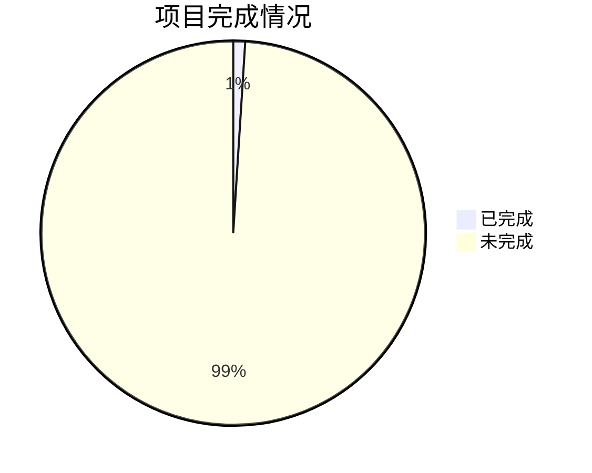

---
title: markdown常见基础命令
date:  2025-10-15
lastmod: 2025-10-15
---

# 一些插件
Markdown All in One  提供自动补全
Markdown Preview Enhanced  优化渲染效果
Markdown Image 改善本地图片的插入效果

### 1.标题:让你的内容层次分明
# 一级标题
## 二级标题
### 三级标题
---
### 2.段落与换行
---为分割线效果
功能二<br>为换行符
现在是2025年4月11号晚上10点，我在学习
继续努力

---

### 3.字体样式：强调你的文字
*斜体*
**粗体**
***粗斜体***
~~删除线~~

---
### 4.列表

**无序列表**
- 可以使用横杠，加号或者星号加空格来开始一行
- 吃饭
- 睡觉
- 打豆豆

**有序列表**
1. 有序列表使用数字加.号来开始一行
2.  
3.  
---

### 5.链接与图片
[百度](http://www.baidu.com)
[本项目github地址](https://github.com/GM-404/CMake_study.git)

网图不显示
 那就来一张自拍

<div align="center"></div>

---

### 6.代码块
- 单行代码`print("Hello World")`
```c++
#include <iostream>
using namespace std;
int main()
{
    cout << "Hello World" << endl;
    return 0;
}
```
```python
print("Hello World")
```
---
### 7.引用
> 引用，这是第一次引用
>> 引用，这是第二次引用，也就是嵌套引用，虽然我认为没卵用
---

### 8.分割线
---
使用横杠，星号，或者下划线来创建分隔符

---
### 9.表格
|表头1:左对齐|表头2：右对齐|表头三：居中对齐|
|----------------:|:---------------|:----:|
|内容1|内容2|我|
|内容3|内容4|你|
---
### 数学公式
- 一行数学公式 $E=mc^2$
- 多行数学公式
$$E=mc^2 $$
不好意思只会这个,那怎么可能$$
d_{t} = \sqrt{x^2 + y^2}\\
d_{i,j} \leftarrow d_{i,j} + 1\\
$$
---
### 流程图：可视化流程

---



